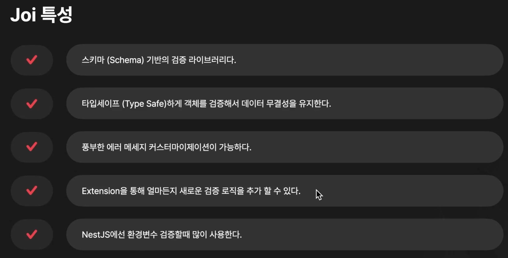
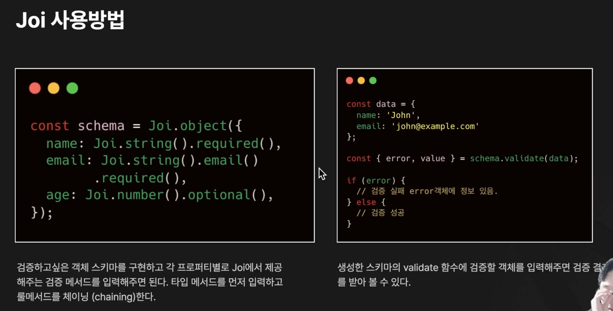
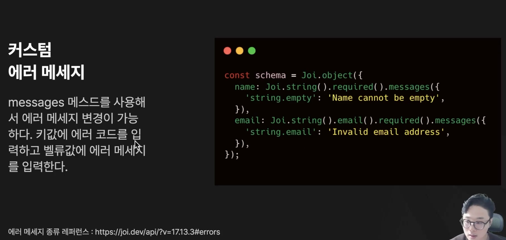
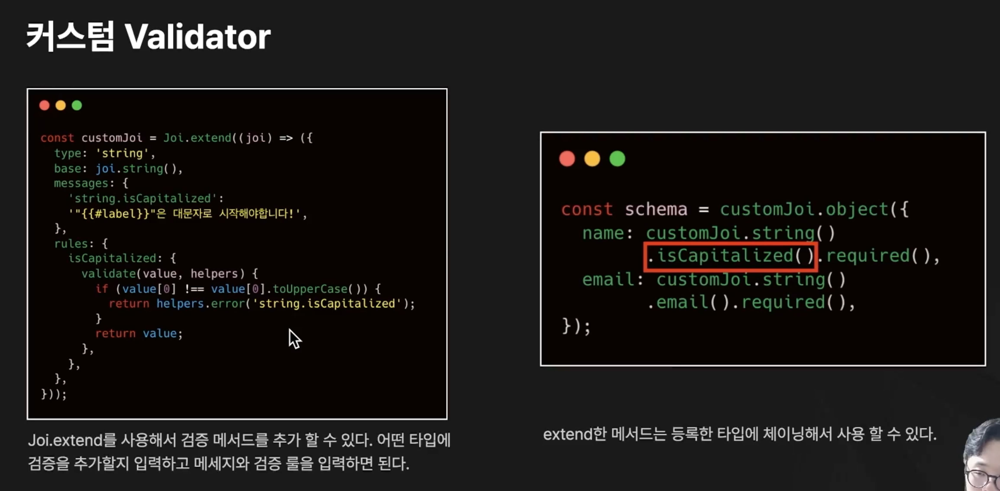

# Part 6. 유효성 검사 및 변환

---

https://codefactory.notion.site/c3469ed438b94dbe88e7be05e6838957

## Ch 1. Class Validator 인트로

### 기본 제공 Class Validator

#### 01. 공통 Validator

```js
@IsDefined
@IsOptional
@Equals
@NotEquals
@IsEmpty
@IsNotEmpty
@IsIn
@IsNotIn
```

#### 02. 타입 Validator

```js
@Isboolean
@IsDate
@IsString
@IsNumber
@IsInt
@IsArray
@IsEnum
```

#### 03. 숫자 Validator

```js
@IsDivisibleBy
@IsPositive
@IsNegative
@Min
@Max
```

#### 04. 문자 Validator

```js
@Contains
@NotContains
@IsAlphanumeric
@IsCreditCard
@IsHexColor
@MaxLength
@MinLnegth
@IsUUID
@IsLatLng
```

### 반환 에러 구조

- `target`: 검증한 객체
- `property`: 검증 실패한 프로퍼티
- `value`: 검증 실패한 값
- `constraints`: 검증 실패한 제약조건
- `children`: 프로퍼티의 모든 검증 실패 제약 조건

```js
{
  target: Object;
  property: string;
  value: any;
  constraints?: {
    [type: string]: string;
  };
  children?: ValidationError[];
}
```

### Class Validator 프로젝트에 적용하기

```bash
pnpm install class-validator class-transformer
```

```js
class PasswordValidator implements ValidatorConstraintInterface {
  validate(value: any, validationArguments?: ValidationArguments): Promise<boolean> | boolean {
    /// 비밀번호 길이는 4-8
    return value.length > 4 && value.length < 8;
  }
  defaultMessage(validationArguments?: ValidationArguments): string {
    return '비밀번호 길이는 4-8자 이어야 합니다. 입력된 비밀번호: ($value)';
  }
}

function IsPasswordValid(validationOptions?: ValidationOptions) {
  return function (object: Object, propertyName: string) {
    registerDecorator({
      target: object.constructor,
      propertyName,
      options: validationOptions,
      validator: PasswordValidator,
    })
  }
}

export class UpdateMovieDto {
  @IsPasswordValid({
      message: '비밀번호 길이는 4-8자 이어야 합니다.',
  })
  password?: string;
}
```

### Expose와 Exclude 적용해보기

```js
@Controller('movie')
@UseInterceptors(ClassSerializerInterceptor) // 응답 데이터를 변환하는 인터셉터
export class MovieController {
```

```js
@Exclude() // 응답 데이터에 제외
export class Movie {
  @Expose() // 응답 데이터에 포함
  id: number;

  @Expose() // 응답 데이터에 포함
  title: string;

  @Expose() // 응답 데이터에 포함
  genre: string;
}
```

### Custom Transfomer 사용해보기

```js
export class Movie {
  id: number;
  title: string;
  @Transform(
      ({ value }) => value.toUpperCase()
  )
  genre: string;
}
```

## Ch 4. Joi








